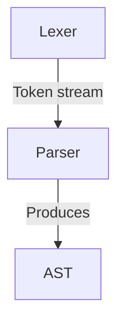

# Parser Documentations

**By: Ali Raza**

**Code: [https://github.com/PatchedDragon/Pasrser](https://github.com/PatchedDragon/Pasrser)**

## 1 Parser

### 1.1 Purpose

This parser implements a **Recursive Descent Parser** using top-down parsing techniques. It receives a token stream from a lexical analyzer and produces an Abstract Syntax Tree (AST) representing the syntactic structure of the input program.

### Key Features

- **Top-down parsing strategy** with recursive descent
- **Operator precedence handling** for arithmetic expressions
- **Symbol table management** for variable tracking
- **Error detection and recovery** using panic mode and phrase-level recovery
- **Position tracking** for precise error reporting
- **Multi-pass error detection** capability

### 1.2 Design Philosophy

The parser follows the principle of **separation of concerns**, where lexical analysis (tokenization) and syntactic analysis (parsing) are distinct phases. This modular approach aligns with industry-standard compiler design patterns.

## 2 Architecture

### 2.1 System Context

### 2.2 Input Specification

**Token Format**: `(token_type, lexeme, line_number, column_number)`

**Example**:

`('KEYWORD', 'int', 1, 0)
('IDENTIFIER', 'x', 1, 4)
('OPERATOR', '=', 1, 6)
('NUMBER', '5', 1, 8)
('SEMICOLON', ';', 1, 9)`

### 2.3 Output Specification

1. **Abstract Syntax Tree (AST)**: Hierarchical representation of program structure
2. **Symbol Table**: Repository of declared variables with type information
3. **Error Log**: Collection of syntax errors with precise locations

## **3 Component Specifications**

### 3.1 AST Node Classes

### Base Class: `ASTNode`

**Purpose**: Foundation for all AST nodes with position tracking

**Attributes**:

- `line` (int): Line number in source code
- `col` (int): Column number in source code

### Node Types

| **Node Class** | **Purpose** | **Key Attributes** |
| --- | --- | --- |
| `Program` | Root node | `statements` (list) |
| `Number` | Numeric literal | `value` (string) |
| `Identifier` | Variable reference | `name` (string) |
| `BinaryOp` | Binary operation | `operator`, `left`, `right` |
| `VarDeclaration` | Variable declaration | `var_type`, `identifier`, `value` |
| `Assignment` | Assignment statement | `identifier`, `value` |

### 3.2 Symbol Table

### Class: `SymbolTable`

**Purpose**: Manages variable scope and declarations

**Operations**:

- `declare(name, type, value)`: Register new variable
- `lookup(name)`: Retrieve symbol information
- `exists(name)`: Check variable existence

**Data Structure**: Hash table (Python dictionary) for O(1) lookup

**Symbol Entry Format**:

`Symbol(name='x', type='int', value=Number(5))` 

### 3.3 Token Management

### Class: `Token`

**Purpose**: Encapsulates token information from lexer

**Attributes**:

- `type`: Token category (KEYWORD, IDENTIFIER, etc.)
- `lexeme`: Actual text representation
- `line`: Source line number
- `col`: Source column number

### 3.4 Operator Precedence (High to Low)

1. **Parentheses**: `( )`
2. **Multiplicative**: , `/`, `%`
3. **Additive**: `+`,

**Associativity**: All operators are left-associative

## **4 Implementation Details**

### Parsing Strategy: Recursive Descent

**Principle**: Each non-terminal in the grammar corresponds to a parsing function

**Example mapping:** 

`expression → Parser.expression()
term       → Parser.term()
factor     → Parser.factor()`

### 4.1 Key Methods

This section will added as development phase starts.

### **4.2 Expression Parsing with Precedence**

This section will added as development phase starts.

### **4.3 Symbol Table Integration**

This section will added as development phase starts.

## **5 Error Handling Strategy**

### Three-Tier Error Recovery

### 1. Panic Mode Recovery

**Trigger**: Syntax error detected

**Strategy**: Skip tokens until synchronization point

**Synchronization Points**:

- Semicolons (`;`)
- Statement-starting keywords (`int`, `if`, `while`, etc.)
- End of file (`EOF`)

**Implementation**:

This section will added as development phase starts.

### 2. Phrase-Level Recovery

**Strategy**: Local corrections for common mistakes

**Implementation**:

This section will added as development phase starts.

### 3. Error Production Handling

**Future Enhancement**: Could extend grammar to handle common mistakes

### **Components**:

- **Line:Column**: Precise error location
- **Descriptive Message**: Clear explanation of issue
- **Context**: Shows expected vs. actual tokens

## **6 Usage Guide**

### 6.1 Basic Usage

`#1. Receive tokens from lexer`

`tokens = [
('KEYWORD', 'int', 1, 0),
('IDENTIFIER', 'x', 1, 4),
('OPERATOR', '=', 1, 6),
('NUMBER', '5', 1, 8),
('SEMICOLON', ';', 1, 9),
('EOF', '', 1, 10)
]`

`#2. Initialize parser`

`parser = Parser(tokens)`

`#3. Parse and generate AST`

`ast = parser.parse()`

`#4. Access results`

`print(ast)                    # View AST structure
print(parser.symbol_table)    # View declared variables
print(parser.errors)          # View error messages`

### **6.3 Integration with Lexer**

Integreation guide will be provided soon.

## **7 Testing Framework**

### 7.1 Test Categories

### 1. Basic Functionality Tests

- Single variable declarations
- Simple assignments
- Expression evaluation

### 2. Precedence Tests

- Complex arithmetic expressions
- Nested parentheses
- Mixed operators

### 3. Symbol Table Tests

- Variable declaration tracking
- Scope management
- Redeclaration detection

### 4. Error Handling Tests

- Missing semicolons
- Undeclared variables
- Incomplete expressions
- Recovery mechanisms

### **7.2 Test Case Structure**

`def run_test_case_X():
    """Test Description"""`

`*# 1. Define input tokens*`

`tokens = [token, lexeme,  line , col]`

`*# 2. Create parser*`

`parser = Parser(tokens)`

`*# 3. Execute parsing*`

`ast = parser.parse()`

`*# 4. Verify results*`

`assert conditions
print(results)`

### **7.3 Expected Output Format**

`Starting parsing process...
Total tokens received from lexer: 6`

`Tokens received from lexer:
('KEYWORD', 'int', 1, 0)
('IDENTIFIER', 'x', 1, 4)
...`

`Parsing completed successfully!`

`Generated AST:
Program(statements=[VarDeclaration(... )])`

`Symbol Table:
Symbol(name='x', type='int')`

## 8 References

**"Compilers: Principles, Techniques, and Tools" (The Dragon Book)**

*Authors*: Alfred V. Aho, Monica S. Lam, Ravi Sethi, Jeffrey D. Ullman

*Publisher*: Pearson, 2nd Edition (2006)

*Relevant Chapters*:

- Chapter 4: Syntax Analysis (Comprehensive coverage of parsing techniques)
- Chapter 4.4: Top-Down Parsing
- Chapter 4.5: Bottom-Up Parsing
- Chapter 4.8: Error Recovery